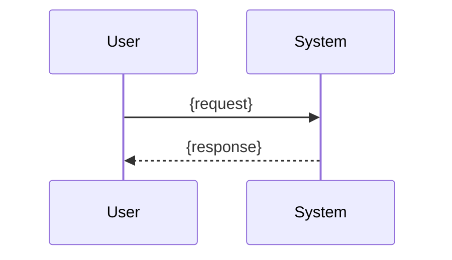

# Design: {feature-name}

## Overview
<!-- 2-3 sentence summary of the technical approach -->

## Architecture

```mermaid
flowchart TD
  A[{Client or caller}] --> B[{Primary component}]
  B --> C[{Dependency}]
```

### Component Responsibilities
- **{component}**: {responsibility}

## Data Flow



## Technical Decisions

| Decision | Options Considered | Choice | Rationale |
|----------|--------------------|--------|-----------|
| {topic} | {option-a, option-b} | {chosen option} | {why} |

## File Structure

| File | Create/Modify | Purpose |
|------|---------------|---------|
| `{path}` | Create / Modify | {purpose} |

## Interfaces

```ts
export interface {InterfaceName} {
  {property}: {type};
}
```

## Error Handling

| Scenario | Strategy | User Impact |
|----------|----------|-------------|
| {failure mode} | {handling approach} | {effect} |

## Edge Cases
- {edge case and handling}

## Dependencies

| Package | Version | Purpose |
|---------|---------|---------|
| {package} | {version} | {purpose} |

## Security
- {security consideration}

## Performance
- {performance consideration}

## Test Strategy
- **Unit:** {what to cover}
- **Integration:** {what to cover}
- **E2E:** {what to cover}

## Existing Patterns to Follow
- {existing codebase pattern with file path}
